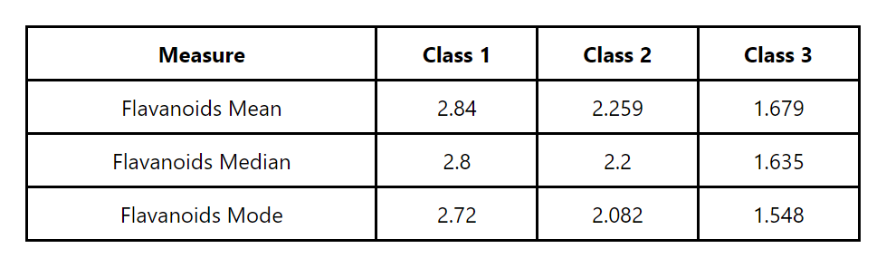
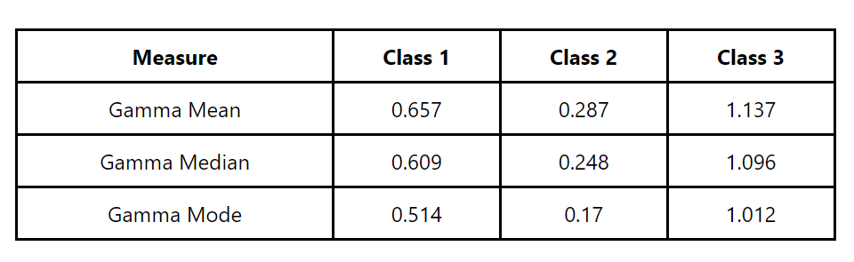

# Data Visualization App

This is a React application for visualizing data using tables. It includes components for displaying statistics such as mean, median, and mode for Flavanoids and Gamma properties in a dataset.

## Screenshots

### Flavanoids Table

### Gamma Table

## Project Structure

The project is structured as follows:

- **src/**

  - **Components/**
    - **Flavanoids.js:** React component for displaying statistics related to Flavanoids.
    - **GammaTable.js:** React component for displaying statistics related to Gamma.
  - **utils/**
    - **mean.js:** Utility function to calculate the mean of a dataset.
    - **median.js:** Utility function to calculate the median of a dataset.
    - **mode.js:** Utility function to calculate the mode of a dataset.
    - **gamma.js:** Utility function to calculate the Gamma property for each point in the dataset.
  - **App.js:** Main component where the data visualization components are used.

  - **Wine-Data.json:** Sample dataset for testing.

## Getting Started

To run the project locally, follow these steps:

1. Clone this repository: `git clone https://github.com/dev15Aditya/data-visualization.git`
2. Navigate to the project directory: `cd data-visualization-app`
3. Install dependencies: `yarn install`
4. Start the development server: `yarn start`

The application will be available at `http://localhost:3000` in your browser.

## Usage

- The `Flavanoids.js` component displays statistics related to Flavanoids.
- The `GammaTable.js` component displays statistics related to the Gamma property.
- The project uses utility functions from the `utils` directory to calculate mean, median, mode, and Gamma.

# data-visualization
